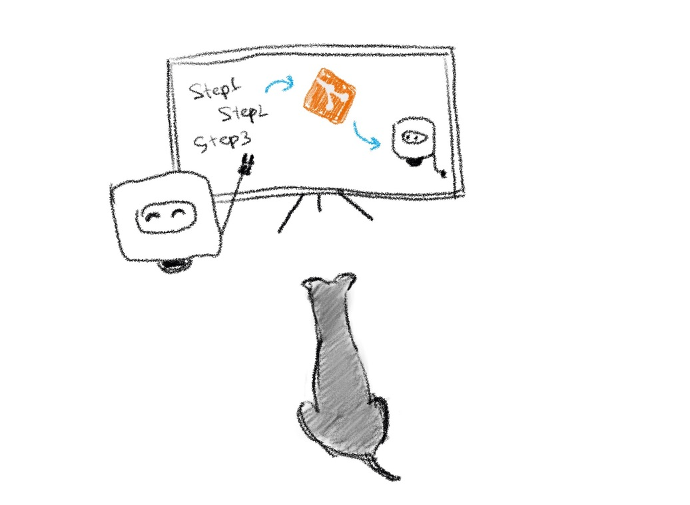

# Chapter 2: The way Boopi reads instructions

I’m glad you agreed to help us to create another tennis ball for Jessie. As we mentioned earlier, Boopi can only craft things if we give him instructions. So, what are the instructions and how to provide them to Boopi? Good questions.

Historically, you can’t give Boopi instructions directly by writing them down on paper. Instead, you need to create a file and load them by using a Git tool. Yes, it may seem like a complicated process. But let me explain it first.

Git is a special tool that you can install on your computer. The main task of Git is to keep track of changes in any set of files. This tool is especially good when a lot of people are involved in the process of adding, changing and deleting files. Because anyone can accidentally delete or change information within files, Git keeps track of who made those changes and when. Thus, you can be sure that your information will never be lost and will always be ready for recovery.

Most often, this program is used by programmers when they are working on a project together. As soon as each program consists of hundreds or thousands of different files, the use of such a program is simply an integral part.

Boopi doesn’t require to create him a hundred files of instructions to craft things. But he follows the same flow of adding, changing or removing files.

I believe that interacting with Boopi can help you learn how to work with Git, and all the knowledge gained in the process will be ready for use in other projects.

Woof-Woof!

Yes, Jessie? Woof! Woof-woof! Ah, I see. You want to play with a tennis ball already, but our reader is just taking the first steps, so be patient.

Let’s move forward and install Git on your computer

