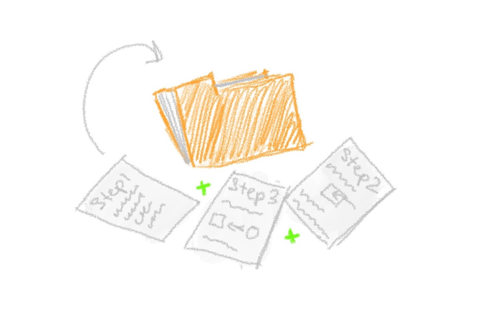

# Chapter 5: Create a folder for Boopi’s instructions

Yes, it took some time to get Git ready for use on our computer. But it can not but rejoice that this process needs to be done only once.

Woof-woof! Good point, Jessie!

Let’s start writing instructions for Boopi.

First off, we need to find a place where we would store our files with instructions. It is a good practice to group related files under a folder somewhere on your computer. So let’s create it. Jessie and I have no claim in which place the folder should be created. The only advice is that the place should be convenient for you.

Woof! Woof!

Jessie sniffed at the new folder. Good job, Jessie, and well done, reader! Let’s enter it and create our first instruction for Boopi!
