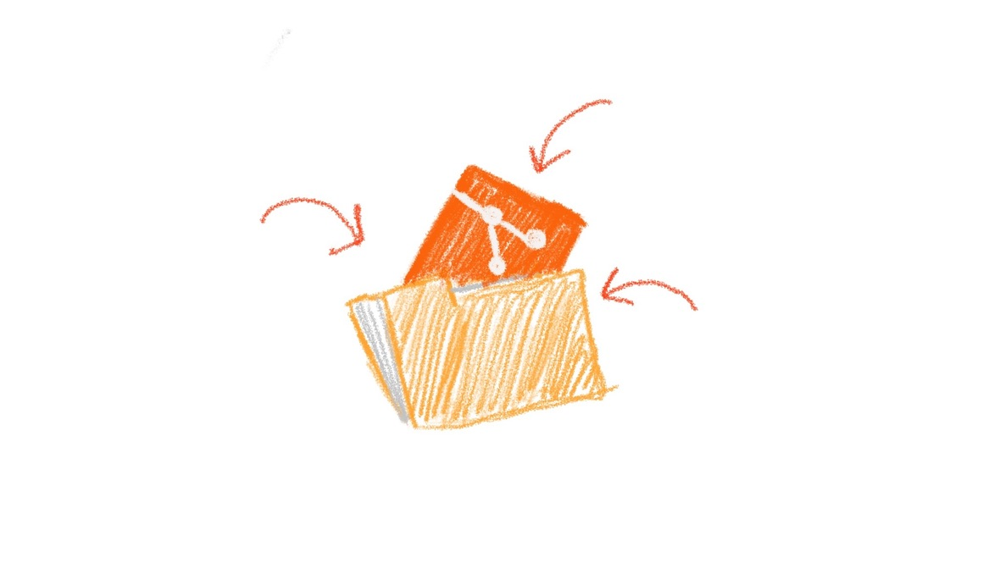

# Chapter 7: Initializing the Git inside the folder



In the previous chapter, we created a `tennis-ball.txt` file, but unfortunately, it wasn’t enough to let Boopi start to craft it. As I said, we need to initialize the Git inside our folder. To initialize Git inside our folder and make aware of our project, we must open the console in the same place where our `tennis-ball.txt` file is located and run the next command.

```
git init
```

> NOTE: Whenever I say open the console and write a command, this implies that the console must always be open in the project folder. That is, at the same level as our `tennis-ball.txt` file or any other project file

After running this command, Git should print hint messages to the console that propose you adjust the default configurations.

```
hint: Using 'master' as the name for the initial branch. This default branch name
hint: is subject to change. To configure the initial branch name to use in all
hint: of your new repositories, which will suppress this warning, call:
hint:
hint: git config --global init.defaultBranch <name>
hint:
hint: Names commonly chosen instead of 'master' are 'main', 'trunk' and
hint: 'development'. The just-created branch can be renamed via this command:
hint:
hint: git branch -m <name>
Initialized empty Git repository in /Users/author/Documents/project/.git/
```

We are not interested in changing anything, so we can skip it for now.

Let’s check our folder. Has something changed?

Yes, there are some changes in our folder, but they are not visible to us.

After running the previous `git init` command, Git created a hidden folder called `.git` inside our folder. 

```
project-folder/
 ├── .git/ (hidden folder)
 └── tennis-ball.txt
```

We can draw such a conclusion by reading this message printed as a last sentence in the console

```
...
Initialized empty Git repository in /Users/author/Documents/project-folder/.git/
```

This hidden folder will store all information about our project, all created, renamed, and deleted files, as well as changes within its files.

But if your OS (operating system) doesn’t show hidden files by default, the only file that should exist in your folder is `tennis-ball.txt` that we created previously, which contains instructions for Boopi. Speaking of Boopi, can he make us a tennis ball already?

Not yet!

Having initialized Git in our folder, we only said that in the future, we will use some Git commands inside this folder. By default, Git won’t do anything unless we ask it to. That is, if we don’t ask Git to pass the Boopi instructions, it won’t do it itself.

So let’s ask Git to pass instructions to Boopi.
