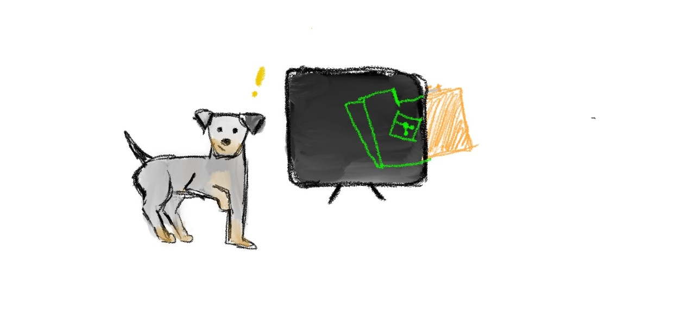

# Chapter 8: Check the state of the folder



In the previous chapter we initialized Git inside our project folder, but I would lie if I said that passing instructions to Boopi would be simple as running a single command. So, it should be easy anyway but requires a few steps to be done before it.

Every time you create a file inside a Git-aware folder Git does not automatically start to track the file and its internals. Remember when I said Git doesn’t do anything without you knowing? Every time you want Git to do something, you must ask him explicitly by running a command that Git can understand.

One of those commands that Git can understand is `git status`.

Let’s run it and after I explain what it does

Open a console and write the following

```
git status
```

After running this command, Git should print the current state of your folder inside your console (or wherever you run this command).

The output should be similar to something like this

```
On branch master

No commits yet

Untracked files:
  (use "git add <file>..." to include in what will be committed)
tennis-ball.txt

nothing added to commit but untracked files present (use "git add" to track)
```

There is much information here, but we can skip most of it for now and focus on this important message.

```
Untracked files:
  (use "git add <file>..." to include in what will be committed)
tennis-ball.txt
```

As I said earlier, Git doesn’t track your files automatically, and the `tennis-ball.txt` file you created is one of those untracked files. This means that if you accidentally (or intentionally) deleted a file and want to restore it, Git can’t help you because it didn’t track it. Even if you remove information inside it (in our case, it is the instruction on how to assemble a tennis ball), Git still is useless.

But how can we ask Git to track it? This is the next command that we will learn.
