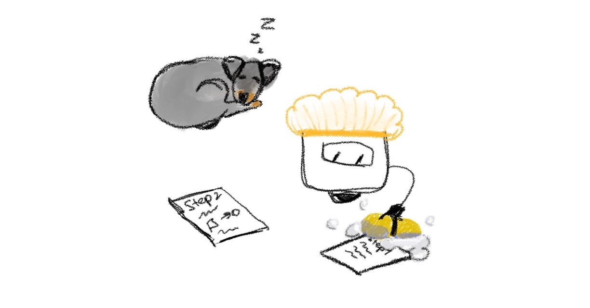

# Chapter 9: Prepare changes to be committed



To ask Git to track our file, we can run the next command.

```
git commit
```

Woof-woof! I know Jessie, it will not work, but let our reader understand why.

Nothing wrong with this command but something is missing. Let’s find it by reading the printed message in our console.

```
On branch master

Initial commit

Untracked files:
  (use "git add <file>..." to include in what will be committed)
tennis-ball.txt

nothing added to commit but untracked files present (use "git add" to track)
```

If you read the message carefully, you should notice this sentence.

```
nothing added to commit but untracked files are present (use "git add" to track)
```

It says that to make our `git commit` command work, we need to specify what files will be included in this commit.

But what is a commit? A commit is a group of changes that were added to Git. Simply saying, everything we add to a commit will be stored in Git and Git will take care of it (will start tracking changes of files that you added to a commit).

So, let’s add our `tennis-ball.txt` file into a commit.

```
git add tennis-ball.txt
```

As you can see, the `git add` command expects the file name that should be added to the commit.

> TIP: `git add` has much more power than specifying a single file name. It also can add multiple files by listing their names separated by a single space or all files with extensions `.txt` by specifying a pattern (e.g. `git add *.txt`)

Using the `git add` command, you asked Git to prepare this file to be ready to be committed, but not committed yet.

Let’s see what happened with our project after running the previous command.

To see the current state of the repository we need to run this command

```
git status
```

It should print something similar to your console

```
On branch master

No commits yet

Changes to be committed:
  (use "git rm --cached <file>..." to unstage)
new file:   tennis-ball.txt
```

Now Git says that there is a new file called `tennis-ball.txt` that will be committed.

After adding a `tennis-ball.txt` file into a staged area, Git makes a snapshot of our file and stores it as a copy in memory. If we make any changes to this file (that were added by using `git add` command and not committed yet), it will not automatically add changes to the snapshot, instead, it will show that some modifications exist and can be added to the commit if we want.

Let’s try to achieve this by opening the `tennis-ball.txt` file and changing the diameter of the ball.

Let’s make changes to the first line of the steps we created

```
Step 1. Create a rubber ball with a diameter of 6.55 cm
Step 2. Color it green
Step 3. Add curved white lines
Step 4. Craft
```

We changed the diameter from `6.54` to `6.55`. The changes are minor, but enough for Git to notice them.

Let’s again run the status command and see what it shows to us

```
git status
```

The output should be similar to

```
On branch master

No commits yet

Changes to be committed:
  (use "git rm --cached <file>..." to unstage)
new file:   tennis-ball.txt

Changes not staged for commit:
  (use "git add <file>..." to update what will be committed)
  (use "git restore <file>..." to discard changes in working directory)
modified:   tennis-ball.txt
```

As you can see, Git is showing us that some modification has happened to our file.

```
Changes to be committed:
  (use "git rm --cached <file>..." to unstage)
new file:   tennis-ball.txt

Changes not staged for commit:
  (use "git add <file>..." to update what will be committed)
  (use "git restore <file>..." to discard changes in working directory)
modified:   tennis-ball.txt
```

This modification is nothing more than a change in diameter.

To confirm our assumptions that these modifications are diameter changes, we can use another useful command called `git diff`. This command requires the name of the file we want to check, so let’s specify the following:

```
git diff tennis-ball.txt
It should print something like
diff --git a/tennis-ball.txt b/tennis-ball.txt
index 81d5611..3c89c6c 100644
--- a/tennis-ball.txt
+++ b/tennis-ball.txt
@@ -1 +1 @@
-Step 1. Create a rubber ball with a diameter of 6.54 cm
+Step 1. Create a rubber ball with a diameter of 6.55 cm
```

This printed message has a lot of useful information. Let’s go through the most important.

The first line says that Git is currently comparing two files, or more accurately, the same file but with two different sets of changes. The fifth line shows the summary of how many lines were affected. It says that one line was removed and one line was added. Actually, we only changed 1 character, but Git treats it as an entire line change (in this example). The last two lines tagged with `-` and `+` show what changes the file has undergone. It shows exactly what we have done, changing the first step and replacing `6.54` with `6.55`.

Cool. This means that Git is doing its job. It tracks changes in our files.

So, at this point, we can do a few more things. Either include our changes to the commit or discard them. In our case it is not big deal will the diameter be `6.54` cm or `6.55` cm. But let’s for education purposes discard our changes. The next command will help us to do it

```
git restore tennis-ball.txt
```

It should remove our changes, that were made after adding `git add tennis-ball.txt`. That is, modified `tennis-ball.txt` should disappear from the git status message.

Let’s verify it by running `git status`

```
On branch master

No commits yet

Changes to be committed:
  (use "git rm --cached <file>..." to unstage)
new file:   tennis-ball.txt
```

Good job! Modification disappeared.

As you can see, we can rely on Git and its tracking capabilities. Whenever we want to get some information about the current state of the project we can ask Git to provide us with this information. The more commands we know, the wider the range of interaction with Git.

We made changes to the file and asked Git to show them to make sure that nothing more was changed. And you made sure that everything is exactly right.

So, in the next chapter, we will create a commit of our staged changes and finally create a tennis ball for Jessie
