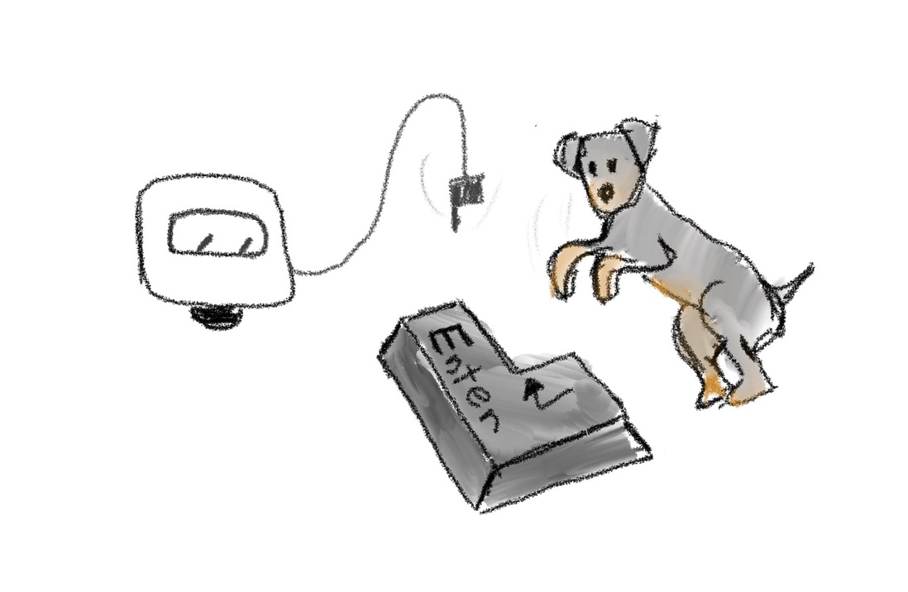

# Chapter 10: Commit changes



In the previous chapter, we added the `tennis-ball.txt` file to the staged area, thus saying that we are ready to commit it.

To make a commit, we need to use the already known `git commit` command. Previously, we tried to make a commit, but we didn’t select any file and Git showed us an error message. Now, we have one file selected, and let’s see what happens next.

```
git commit
```

After running these command the default editor should be opened with this content

```
# Please enter the commit message for your changes. Lines starting
# with '#' will be ignored, and an empty message aborts the commit.
#
# On branch master
#
# Initial commit
#
# Changes to be committed:
#       new file:   tennis-ball.txt
```

If you read this text you will notice that `git commit` contains the information of the current status of the project and the message above

```
# Please enter the commit message for your changes. Lines starting
# with '#' will be ignored, and an empty message aborts the commit.
```

It means that we need to provide a review of what we have done. Usually, one line of description is enough.

So, let’s put the cursor on the first line and write the description.

> NOTE: Before adding any information I should mention that usually Git uses Vim as a default editor. You would ask me why I have to make attention on it. Because Vim has special unique features. One of those features is that you are not able to write text directly. By default, when you open Vim, it goes with `Normal` mode where each key has special meaning: `w` jumps to the start of the word, `e` jumps to the end of the word and `i` switches to `Insert mode`. `Insert mode` is a mode where each key becomes a regular key as we would expect. So let’s press the `i` key on the keyboard. The `—INSERT—` word should be shown at the left bottom of the screen of your editor. After providing a commit description, you need to press `:` and write `wq` (`w` - write, `q` - quite) to save changes.

Add a file with instructions on how to create a tennis ball

After writing the commit message close the editor. If a commit was created, the following message should be shown in the console

```
[master (root-commit) e6d979b] Add a file with instructions on how to create a tennis ball
 1 file changed, 1 insertion(+)
 create mode 100644 tennis-ball.txt
```

It confirms that a new commit was created.

Once a commit is created, Git starts storing the files added to the commit inside its “internals”. By that, I mean a hidden `.git` folder that was automatically created during Git initialization. Thus, from now on, the file `tennis-ball.txt` should be tracked by Git, and any future changes should be reflected without adding them to the staged area by using git add command.

What’s going on… Boopi starting to craft something. Woof-woof! Look at Boopi! Woof-Woof! This is a tennis ball! Thank you, Boopi, and thank you, reader! Now Jessie has a new tennis ball!

Do you like it, Jessie? Woof! Alright!

Let’s make a quick recap of what we have already learned.

We learned that in order to start using Git commands inside our folder, we first had to initialize Git with the `git init` command. It created a hidden `.git` folder inside our project folder (besides the `tennis-ball.txt` file) where Git stores the information that helps him to keep track of our files and their changes.

By default, Git does not automatically add these files to the `.git` folder, so we had to add them explicitly with `git commit`.

Before we created a commit, we had to decide which files should be included in the commit and select them with the `git add` command. After we added the file `tennis-ball.txt` to the staged area, Git took a snapshot of the file and said that this file is now being tracked by me. After we changed the diameter of the tennis ball inside instructions, Git showed us that some changes were made. We inspected those changes by using `git diff` and discarded them with a `git reset` command.

Finally, when the file was ready to be committed, we used the `git commit` command, which opened the default editor and asked us to provide a description of the current commit. After providing the message and closing the editor, the commit was added to Git and Git started to track our file. Even if we delete some of the internal parts of the file in the future, or delete it altogether, Git will notice those changes and let us know but only when we run the `git status` command.

Well done reader, looks like we did what we wanted. But this is not the end, let’s see what else awaits us in the next chapters.
