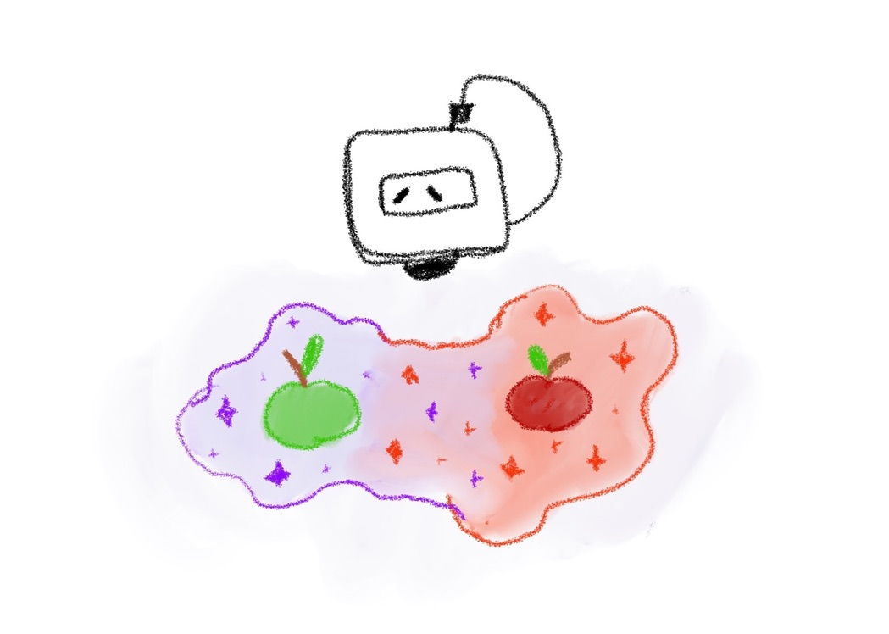

# Chapter 12: Same things from different universes



In the previous chapter, we created two toys for Jessie’s friends. Each of these toys was created and committed to a separate branch. In order for these toys to appear in the `master` branch, we had to merge each branch into the `master`. So, Boopi was able to create toys for these cuties.

But what if we could create instructions for the same toy in parallel and merge them together? What would happen? What would happen if two same things from different universes appeared in one? Do they merge at all? Let’s figure it out!

To do this experiment, we will need to create an apple in two separate branches.

Woof-woof!

I know Jessie, Boopi doesn’t like apples. But let’s create them anyway.

Firstly off, we have to be on the `master` branch. Secondly, we will create a new branch called `red-apple` and jump into it.

Starting on the `master` branch execute the following commands

```
git branch red-apple
git checkout red-apple
```

Having done this, we created a new branch and moved into it.

Let’s create a file and call it `apple.txt`

Open the file and put the following instruction inside it.

```
Step 1. Create a red apple
```

Save the file and close it.

At this moment, we should be on the `red-apple` branch with one new (untracked) file called `apple.txt`. You can verify it on your own by running `git status`. We will skip this optional step and continue

Let’s commit the `apple.txt` file with instructions inside of it

Inside the console write the following

```
git add apple.txt
git commit -m "Add a file with instructions on how to create a red apple"
```

Good. At this point, we created a file with instructions and committed it to the `red-apple` branch.

Let’s switch back to the `master` branch and do the same things.

```
git checkout master
```

After switching to the `master` branch, let’s create an `apple.txt` file and pass those instructions inside it

```
Step 1. Create a green apple
```

Save the file and close it.

Woof-woof! 

Yes, Jessie, I know. We have just created an apple in a different color than the one we created in the `red-apple` branch. But I will explain it later. For now, let’s continue and commit the file.

Let’s create a commit on the `master` branch with an `apple.txt` file inside of it.

To achieve this we will execute the following commands

```
git add apple.txt
git commit -m "Add a file with instructions on how to create a green apple"
```

Well done!

Now we should have another commit on the `master` branch. We have almost reached the climax of our experiment, but before we merge the `red-apple` branch into it, let’s try to predict what might happen:

1. The `apple.txt` file from `red-apple` branch will replace `apple.txt` file in the `master` branch 
2. The `apple.txt` file on the `master` branch will not be replaced and remains untouched
3. The `apple.txt` file will contain instructions from both branches (e.g. they will be merged)
4. Black hole

None of the above options are correct. Let’s figure out what will actually happen

Woof-woof! I know Jessie, you know what will happen, but let our reader go through this on his own.

As far as we are already on the `master` branch, let’s merge the `red-apple` branch into it.

```
git merge red-apple
```

Oh, no! What just happened?

Let’s see what the console message says.

```
Auto-merging apple.txt
CONFLICT (add/add): Merge conflict in apple.txt
Automatic merge failed; fix conflicts and then commit the result.
```

You may notice the word in capital letters - CONFLICT. It is exactly what happened - a merge conflict. Merge conflicts are the most common problem of newbies who start to work with Git. But don’t be scared. Jessie and I will try to explain when they happen and how to resolve them.

Yes, Jessie? Woof-woof! Alright!

If you run the `git status` command and investigate the result message, you may notice that Git says that you have “unmerged paths”, and under “Unmerged paths:” title, you can see the message - “both added: apple.txt”. 

```
On branch master
You have unmerged paths.
  (fix conflicts and run "git commit")
  (use "git merge --abort" to abort the merge)

Unmerged paths:
  (use "git add <file>..." to mark resolution)
both added: apple.txt

no changes added to commit (use "git add" and/or "git commit -a")
```

It is exactly what happened. Two branches were trying to add an `apple.txt` file at once, but there are conflicts inside this file. If we open the file with your favorite editor, you may notice that the file contains something more than the instructions of both files.

```
<<<<<<< HEAD
Step 1. Create a green apple
=======
Step 1. Create a red apple
>>>>>>> red-apple
```

Don’t be scared. We will go through this file step by step

The first lines says that everything starting from `<<<<<<< HEAD` till `=======` belongs to one file, and everything after `=======` and until `>>>>>>> red-apple` belongs to the another one.

But what does it all mean anyway? This means that during the merge process, when Git tried to automatically merge files (that is exactly what happens under the hood when we write a `git merge` command) and their internals from different branches, it could not decide on its own which change to apply.

When Git does not know what changes to apply, he asks the user to help him. So now, you as the user must help him to make a decision. It is easier than you may think.

All we need to do is to leave those changes that we’re interested in. If we created two apples with different colors, we must decide what apple in what color to leave. Also, instead of creating a single apple, we could create two apples in two different steps, for instance

```
Step 1. Create a green apple
Step 2. Create a red apple
```

As you can see, there are many options of what to do with the conflicts, and only the user may know what exactly to do. So instead of creating two apples let’s leave a single instruction with a green apple, for example

```
Step 1. Create a green apple
```

Save changes and close the file.

Note, that we also removed all techincal lines, like: `<<<<<<< HEAD`, `=======` and `>>>>>>> red-apple`. They were only needed when resolving merge conflicts and are completely redundant after resolving them.

If we go back to the console and find the message that printed a message after CONFLICT occurred, you may notice the instructions

```
...; fix conflicts and then commit the result.
```

We fixed conflicts. The last step that we need to do is to commit results.

Let’s add an `apple.txt` file to the staged area

```
git add apple.txt
```

and make a commit

```
git commit
```

It should open a default editor with a predefined message.

```
Merge branch 'red-apple'
```

We can leave it as is. Save and close the file.

Well done! You solved your first conflict!

Look at Boopi! He crafted a green apple! Good job, reader!

As you remember, don’t forget to remove branches that you will not use anymore. It is a good practice to keep your repository in a clean state.

```
git branch -d red-apple
```

We passed the scariest part for newbies, and it was fun, wasn’t it? 

Woof-woof!

Let’s continue
