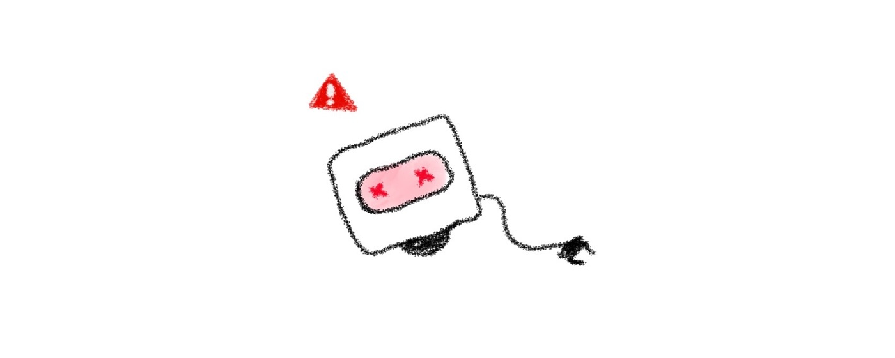

# Chapter 13: Fixing the Boopi that was accidentally broken



As we remember, every time a commit appears in the history on the `master` branch, it signals Boopi to start to craft things. But what if we accidentally commit the file that does not contain instructions for Boopi. Will Boopi understand how to handle it on his own? Or will he break? Let’s figure out what happens.

Let’s create a file called `banana.txt` and put something inside that Boopi does not know.

Let’s open a `banana.txt` file and write the following.

```
Step -1: abcdefg
```

Save the file and close it.

As you can see, we created a step with a negative number (-1), and also added Latin characters, which makes no sense for Boopi. At least we can assume that these characters are something that Boopi will not understand.

Now, let’s commit this file.

```
git add banana.txt
git commit -m "Add a file with instructions on how to create a banana"
```

Commit was created. Let’s see what happened with Boopi.

Boopi, can you hear us? If yes, give us a sign!

Woof-woof!

Oops, looks like we broke Boopi

As you may have noticed, we did it on purpose. I would never ask you to do something that would totally break Boopi or anyone else. So let’s think about what we can do to bring Boopi back to “life”.

How can we undo the instructions that we gave to Boopi? The simplest solution would be to remove the file that we committed. That is, remove the file in our folder and create a new commit (e.g. `“Remove a file with incorrect instructions on how to create banana”`).

Instead of doing it manually, Git has a special command that can do it for us. The name of the command is `git revert`.

Whenever you make a commit that doesn’t work as expected, you can use a special `git revert <commit_hash>` command to roll back those changes. As you can see, it requires the hash of the commit. We can find this hash inside Git logs by running the `git log` command. As far as we want to undo the latest commit in our history, we can specify an additional `-1` parameter with the `git log` command to prevent printing all the existing commits on the branch (except the latest one). Let’s write it

```
git log -1
```

It should print the description of the lastest commit in our Git history

```
commit e6d979b1498e7d27cba0780e23c7bfbeca84790e (HEAD -> master)
Author: Roman Mahotskyi <roman.mahotskyi@gmail.com>
Date:   Tue Jul 5 19:14:41 2022 +0300

Add a file with instructions on how to create a banana
```

Let’s copy the hash on the first line of the log message. Yes, all these numbers and characters combined into a sequence of symbols is called a hash.

```
e6d979b1498e7d27cba0780e23c7bfbeca84790e
```

Now, we can write a revert command with the already copied hash of the latest commit. (I remind you that this “latest commit” broked Boopi)

```
git revert e6d979b1498e7d27cba0780e23c7bfbeca84790e
```

It should open an editor with a default commit message.

```
Revert "Add a file with instructions on how to create a banana"

This reverts commit e6d979b1498e7d27cba0780e23c7bfbeca84790e.
```

If you want, you can change this commit message and its description or leave it as is.

After saving changes and closing the editor, Git must automatically revert the recently added commit. Or, in other words, Git must remove the `banana.txt` file with incorrect instructions.

We can verify this by opening the folder of our project.

It looks like the file with the bad instruction no longer exists.

If you run a `git log -2` command again, you should notice that the commit where we have added a `banana.txt` file still exists in history as well as a new commit with the message `Revert “Add a file with instructions on how to create a banana”`.

I know it’s not what you expected. You might expect that commit with the message `“Add a file with instructions on how to create a banana”` to disappear from the Git history. Or in other words, the history will be cleared of the unnecessary commit. In our case, the commit that broke Boopi.

But let’s see what actually happened.

Whenever you revert changes, Git instead of re-writing the history and removing the existing commit creates a new commit with mirrored changes. In our case, in that commit, we created a single file called `banana.txt` and added it to the commit. After running `git revert` Git removed this file for us and created a new commit with changes. If we didn’t create the file but only made some changes to it, Git would remove those changes and create a new commit without removing a file.

I hope this makes sense and you will be able to undo any changes that could be harmful in some way.

Woof-woof! Yes, it seems like Boopi is working again! Are you alright Boopi?

Boop-boop!

Alright!

Let’s move on to the next chapter, where we’ll learn how not to break Boopi with files that weren’t exactly intended for it.
